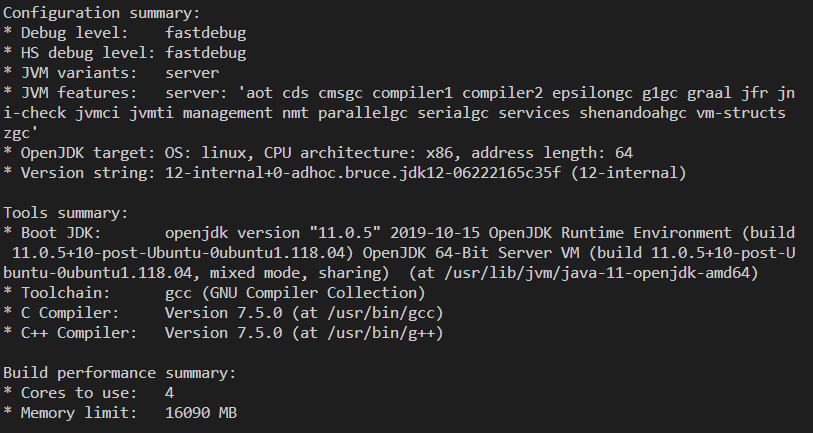
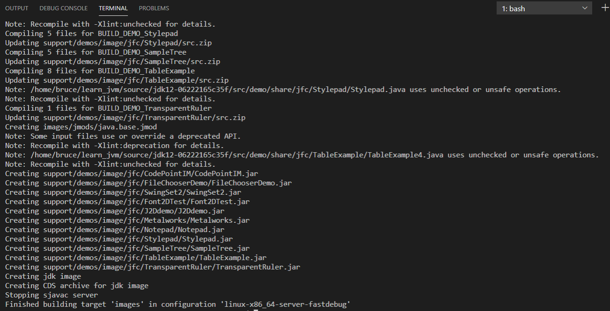
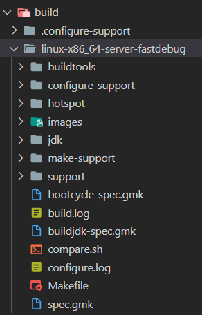
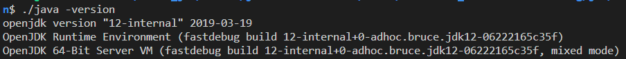

# 1环境搭建  
## WSL2 Ubuntu18.04LTS  
空闲内存2 ~ 4G,磁盘6 ~ 8G  

### 编译目标  
OpenJDK12  
源码地址`https://hg.openjdk.java.net/jdk/jdk12/`  
  
点左边browse可以看到源码目录  
再点zip下载zip包(171MB)  
下载完解压找个地方放好  

### 所需组件安装  
* GCC(4.8以上,或CLang 3.2以上):`sudo apt-get install build-essential`  
* FreeType:`sudo apt-get install libfreetype6-dev`  
* CUPS:`sudo apt-get install libcups2-dev`  
* X11:`sudo apt-get install libx11-dev libxext-dev libxrender-dev libxrandr-dev libxtst-dev libxt-dev`  
* ALSA:`sudo apt-get install libasound2-dev`  
* libffi:`sudo apt-get install libffi-dev`  
* Autoconf:`sudo apt-get install autoconf`  
* OpenJDK11或以后版本:`sudo apt-get install openjdk-11-jdk`  

## 编译  
进入解压后路径,先执行命令:`bash configure --enable-debug --with-jvm-variants=server`进行依赖检查  
检查成功示例:  
会报字体配置错误,解决方法:`sudo apt-get install libfontconfig1-dev`  
一切完成后可以开始编译了:`make images`,全量编译大概需要等十多分钟,cpu会狂转  
编译成功!   
编译成功后build文件下目录结构:   

> buildtools/:用于生成,存放编译过程中用到的工具   
> hotspot/:HotSpot虚拟机编译的中间文件  
> images/:用make *-image产生的镜像存放在这里  
> jdk/:编译后产生的JDK就放在这里  
> configure-support/  make-support/  test-support/:这三个目录存放执行configure',make和test的临时文件  

## 启动  
这个时候jdk就能用了,进jdk目录`cd build/linux-x86_64-server-fastdebug/jdk/bin/`,输入`./java -version`就能看到版本信息啦~   
