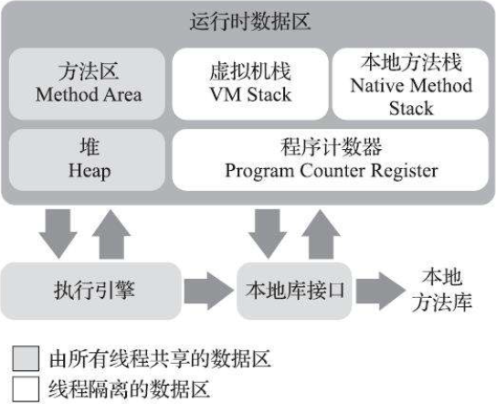

# 运行时数据区域  
  
------
## 线程隔离的数据区  
### 1.程序计数器（Program Counter Register）  
* 一块较小的内存空间,用来指向当前线程下一条执行的字节码的行号  
* 字节码解释器工作时就是通过改变计数器的值来选取下一条需要执行的字节码指令  
* 每个线程有一个独立的程序计数器,且各个计数器互不影响,独立储存,我们称这类内存区域为"`线程私有`"的内存.  
* 线程执行java方法,计数器指向正在执行的虚拟机字节码指令地址;执行本地(Native)方法,计数器值则为空(Undefined).
* 此内存区域是唯一一个在《Java虚拟机规范》中没有规定任何OutOfMemoryError情况的区域.  

### 2.Java虚拟机栈（Java Virtual Machine Stack）  
* `线程私有`,生命周期与线程相同  
* 虚拟机栈描述的是Java方法执行的线程内存模型：每个方法被执行的时候，Java虚拟机都会同步创建一个栈帧用于存储`局部变量表`、`操作数栈`、`动态连接`、`方法出口`等信息。每一个方法被调用直至执行完毕的过程，就对应着一个栈帧在虚拟机栈中从入栈到出栈的过程。
* 如果线程请求的栈深度大于虚拟机所允许的深度，将抛出`StackOverflowError`异常；如果Java虚拟机栈容量可以动态扩展，当栈扩展时无法申请到足够的内存会抛出`OutOfMemoryError`异常。

### 3.本地方法栈（Native Method Stacks）  
* 与虚拟机栈相似,区别只是为虚拟机使用到的本地（Native）方法服务。  

## 线程共享数据区  
